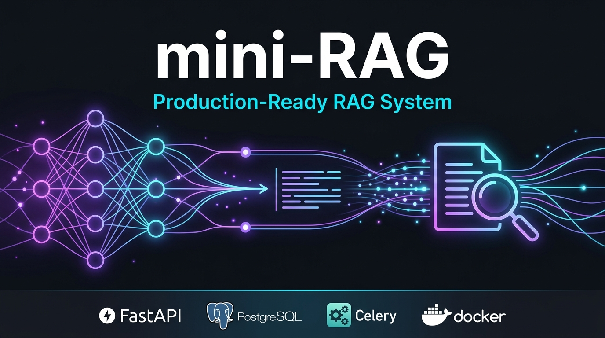

<p align="center">
  
</p>

<h1 align="center">mini-RAG</h1>

<p align="center">
  <strong>A production-ready Retrieval-Augmented Generation (RAG) system for the Gym &amp; Health domain</strong><br/>
  Built with FastAPI &middot; PostgreSQL + pgvector &middot; Celery &middot; Docker &middot; LLM-agnostic
</p>

<p align="center">
  
  
  
  
  
  
</p>

---

## Table of Contents

- [Overview](#overview)
- [Architecture](#architecture)
- [Tech Stack](#tech-stack)
- [Prerequisites](#prerequisites)
- [Quick Start Docker Recommended](#quick-start--docker-recommended)
- [Access Services](#access-services)
- [Viewing the Database](#viewing-the-database)
- [Development Mode](#development-mode-without-docker)
- [Environment Variables Reference](#environment-variables-reference)
- [Docker Services Reference](#docker-services-reference)
- [Monitoring](#monitoring-grafana--prometheus)
- [Postman Collection](#postman-collection)
- [Troubleshooting](#troubleshooting)
- [Project Structure](#project-structure)

---

## Overview

`mini-RAG` lets users upload domain documents (gym & health content), automatically processes and indexes them into a vector database, and answers questions using **semantic search + LLM-generated, context-augmented responses**.

**Pipeline flow:**

```
User uploads document
       |
FastAPI receives file -> stores it -> triggers Celery background task
       |
Celery worker: parses text -> chunks it -> embeds with Cohere/OpenAI
       |
Vectors stored in PostgreSQL (pgvector) or Qdrant
       |
User asks a question -> semantic search -> top-K chunks retrieved -> LLM generates answer
```

---

## Architecture

```
                         +--------------------------------------------+
                         |          Docker Network (backend)          |
                         |                                            |
  Browser / Postman ---> |  Nginx (80) --> FastAPI (8000)            |
                         |                     |                      |
                         |        +------------+------------+         |
                         |        v            v            v         |
                         |   PostgreSQL   RabbitMQ (5672) Redis(6379) |
                         |  + pgvector    (message broker) (results)  |
                         |        |            |                       |
                         |        |       Celery Worker               |
                         |        |       Celery Beat                 |
                         |        |       Flower (5555)               |
                         |        v                                    |
                         |     Qdrant (6333)                          |
                         |                                            |
                         |   Prometheus (9090) --> Grafana (3000)     |
                         +--------------------------------------------+
```

---

## Tech Stack

| Layer | Technology |
|---|---|
| **API** | FastAPI + Uvicorn |
| **Database** | PostgreSQL 17 + pgvector extension |
| **Vector Search** | pgvector (default) or Qdrant |
| **Background Tasks** | Celery Workers + Beat Scheduler |
| **Message Broker** | RabbitMQ |
| **Results Backend** | Redis |
| **LLM / Generation** | OpenAI GPT-4o-mini (pluggable) |
| **Embeddings** | Cohere embed-multilingual-v3.0 (pluggable) |
| **Monitoring** | Prometheus + Grafana + Flower |
| **Containerization** | Docker + Docker Compose |
| **Migrations** | Alembic |

---

## Prerequisites

Before you start, make sure the following are installed:

| Tool | Version | Download |
|---|---|---|
| **Docker Desktop** | Latest | https://www.docker.com/get-started/ |
| **Docker Compose** | v2+ (bundled with Docker Desktop) | Bundled |
| **Git** | Any | https://git-scm.com/ |
| **Python** (dev mode only) | 3.10 | https://www.python.org/downloads/ |

> **Windows users**: Enable WSL2 integration in Docker Desktop settings for best performance.

---

## Quick Start Docker Recommended

> This is the **easiest and recommended** way to run the entire project with all services.

### Step 1 Clone and navigate

```bash
git clone https://github.com/YOUR_USERNAME/mini-rag-app.git
cd mini-rag-app
```

### Step 2 Set up environment files

You must copy the example environment files before starting.

**Linux / macOS:**
```bash
cd docker/env
cp .env.example.app               .env.app
cp .env.example.postgres          .env.postgres
cp .env.example.grafana           .env.grafana
cp .env.example.postgres-exporter .env.postgres-exporter
cp .env.example.rabbitmq          .env.rabbitmq
cp .env.example.redis             .env.redis

cd ../minirag
cp alembic.example.ini alembic.ini
```

**Windows (PowerShell):**
```powershell
cd docker\env
Copy-Item .env.example.app               .env.app
Copy-Item .env.example.postgres          .env.postgres
Copy-Item .env.example.grafana           .env.grafana
Copy-Item .env.example.postgres-exporter .env.postgres-exporter
Copy-Item .env.example.rabbitmq          .env.rabbitmq
Copy-Item .env.example.redis             .env.redis

cd ..\minirag
Copy-Item alembic.example.ini alembic.ini
```

### Step 3 Add your API keys

Open `docker/env/.env.app` in any text editor and fill in your keys:

```env
# Required - your OpenAI API key
OPENAI_API_KEY="sk-your-key-here"

# Required - your Cohere API key (for embeddings)
COHERE_API_KEY="your-cohere-key-here"
```

Get your keys from:
- **OpenAI**: https://platform.openai.com/api-keys
- **Cohere**: https://dashboard.cohere.com/api-keys

### Step 4 Build and start all services

```bash
cd docker
docker compose up --build -d
```

> The **first build takes 3-8 minutes** as it installs Python dependencies. Subsequent starts are instant.

**Starting only specific services (minimal development setup):**

```bash
# Start infrastructure first
docker compose up -d pgvector qdrant rabbitmq redis
# Wait 20 seconds for them to become healthy, then start the app
docker compose up -d fastapi celery-worker celery-beat flower nginx
```

### Step 5 Verify everything is running

```bash
docker compose ps
```

All containers should show status `Up` or `healthy`. Then open:

```
http://localhost:8000/docs
```

You should see the interactive FastAPI Swagger UI.

---

## Access Services

| Service | URL | Default Credentials |
|---|---|---|
| **FastAPI Swagger UI** | http://localhost:8000/docs | - |
| **FastAPI ReDoc** | http://localhost:8000/redoc | - |
| **Nginx (proxy)** | http://localhost | - |
| **RabbitMQ Management** | http://localhost:15672 | `minirag_user` / `minirag_rabbitmq_2222` |
| **Flower (Celery Monitor)** | http://localhost:5555 | `admin` / `minirag_flower_2222` |
| **Qdrant Dashboard** | http://localhost:6333/dashboard | - |
| **Prometheus** | http://localhost:9090 | - |
| **Grafana** | http://localhost:3000 | `admin` / `admin_password` |
| **PostgreSQL** | `localhost:5400` | `postgres` / `postgres_password` |
| **Prometheus Metrics** | http://localhost:8000/metrics | - |

---

## Viewing the Database

### Option A pgAdmin for PostgreSQL

The project uses **PostgreSQL + pgvector** as the primary database.

1. Download and install **pgAdmin 4**: https://www.pgadmin.org/download/
2. Open pgAdmin -> right-click **Servers** -> **Register -> Server**
3. Fill in the connection details:

| Field | Value |
|---|---|
| **Name** | mini-RAG Local |
| **Host** | `localhost` |
| **Port** | `5400` |
| **Database** | `minirag` |
| **Username** | `postgres` |
| **Password** | `postgres_password` |

4. Click **Save**. You will see the `minirag` database with all tables created by Alembic migrations.

#### Using DBeaver (free, cross-platform)

1. Download DBeaver: https://dbeaver.io/download/
2. **New Connection** -> select **PostgreSQL**
3. Use the same connection details as above
4. Tables (`projects`, `assets`, `data_chunks`) are under `minirag -> Schemas -> public -> Tables`

---

### Option B Studio 3T for MongoDB

> **IMPORTANT NOTE**: The current production version of this project uses **PostgreSQL + pgvector**, NOT MongoDB.
> The `docker/mongodb/` folder contains leftover data files from a previous version of the project.
>
> Only follow this section if you are working with an **older branch** that used MongoDB.

#### Connecting Studio 3T to a local MongoDB instance

1. Download and install **Studio 3T**: https://studio3t.com/download/
2. Install **MongoDB Community Server** locally: https://www.mongodb.com/try/download/community
   - Default port: `27017`
3. Open Studio 3T -> click **Connect** -> **New Connection**
4. Fill in the connection details:

| Field | Value |
|---|---|
| **Connection Name** | mini-RAG Mongo |
| **Server** | `localhost` |
| **Port** | `27017` |
| **Authentication** | None (for local dev) |

5. Click **Save**, then **Connect**

#### Running MongoDB via Docker (optional)

```bash
docker run -d \
  --name mongodb \
  -p 27017:27017 \
  -v mongodb_data:/data/db \
  mongo:7.0
```

Then connect Studio 3T to `localhost:27017`.

---

## Development Mode Without Docker

For local development without Docker, run each service manually.

### 1 Install Python 3.10 via MiniConda

```bash
conda create -n mini-rag python=3.10
conda activate mini-rag
```

### 2 Install dependencies

```bash
cd src
pip install -r requirements.txt
```

### 3 Set up environment variables

```bash
cd src
cp .env.example .env
# Edit .env with your API keys and local DB connection strings
# Change POSTGRES_HOST from "pgvector" to "localhost"
# Change CELERY_BROKER_URL host from "rabbitmq" to "localhost"
# Change CELERY_RESULT_BACKEND host from "redis" to "localhost"
```

### 4 Run infrastructure via Docker

```bash
cd docker
docker compose up -d pgvector qdrant rabbitmq redis
```

### 5 Run Alembic database migrations

```bash
cd src/models/db_schemes/minirag
alembic upgrade head
```

### 6 Start FastAPI server

```bash
cd src
uvicorn main:app --reload --host 0.0.0.0 --port 8000
```

### 7 Start Celery services (each in a separate terminal)

**Celery Worker:**
```bash
cd src
python -m celery -A celery_app worker --queues=default,file_processing,data_indexing --loglevel=info
```

**Celery Beat:**
```bash
cd src
python -m celery -A celery_app beat --loglevel=info
```

**Flower Dashboard:**
```bash
cd src
python -m celery -A celery_app flower --conf=flowerconfig.py
# Open http://localhost:5555
```

---

## Environment Variables Reference

### docker/env/.env.app - Main Application

| Variable | Description | Default |
|---|---|---|
| `OPENAI_API_KEY` | OpenAI API key | *(required)* |
| `COHERE_API_KEY` | Cohere API key for embeddings | *(required)* |
| `GENERATION_BACKEND` | LLM provider (`OPENAI`) | `OPENAI` |
| `EMBEDDING_BACKEND` | Embedding provider (`COHERE`) | `COHERE` |
| `GENERATION_MODEL_ID` | LLM model ID | `gpt-4o-mini` |
| `EMBEDDING_MODEL_ID` | Embedding model | `embed-multilingual-v3.0` |
| `EMBEDDING_MODEL_SIZE` | Vector dimensions | `1024` |
| `VECTOR_DB_BACKEND` | Vector DB (`PGVECTOR` or `QDRANT`) | `PGVECTOR` |
| `POSTGRES_HOST` | PostgreSQL host | `pgvector` |
| `POSTGRES_PORT` | PostgreSQL port | `5432` |
| `POSTGRES_PASSWORD` | PostgreSQL password | `postgres_password` |
| `CELERY_BROKER_URL` | RabbitMQ connection string | see example file |
| `CELERY_RESULT_BACKEND` | Redis connection string | see example file |
| `PRIMARY_LANG` | Primary response language | `en` |

### docker/env/.env.postgres - PostgreSQL

| Variable | Description | Default |
|---|---|---|
| `POSTGRES_USER` | Database user | `postgres` |
| `POSTGRES_PASSWORD` | Database password | `postgres_password` |
| `POSTGRES_DB` | Database name | `minirag` |

> If you change passwords in `.env.postgres`, update them in `.env.app` as well.

---

## Docker Services Reference

| Service | Image | Purpose | Port |
|---|---|---|---|
| `fastapi` | Custom build | Main REST API | `8000` |
| `nginx` | nginx:stable-alpine | Reverse proxy | `80` |
| `celery-worker` | Custom build | Background task processor | - |
| `celery-beat` | Custom build | Periodic task scheduler | - |
| `flower` | Custom build | Celery monitoring UI | `5555` |
| `pgvector` | pgvector/pgvector:0.8.0-pg17 | PostgreSQL with vector extension | `5400` |
| `qdrant` | qdrant/qdrant:v1.13.6 | Alternative vector DB | `6333` |
| `rabbitmq` | rabbitmq:4.1.2-management-alpine | Message broker | `5672`, `15672` |
| `redis` | redis:8.0.3-alpine | Results backend and cache | `6379` |
| `prometheus` | prom/prometheus:v3.3.0 | Metrics collection | `9090` |
| `grafana` | grafana/grafana:11.6.0 | Metrics dashboards | `3000` |
| `node-exporter` | prom/node-exporter:v1.9.1 | System metrics | `9100` |
| `postgres-exporter` | prometheuscommunity/postgres-exporter | PostgreSQL metrics | `9187` |

### Useful Docker commands

```bash
# View logs for a specific service
docker compose logs -f fastapi
docker compose logs -f celery-worker

# Restart a specific service
docker compose restart fastapi

# Stop all services (keep data)
docker compose down

# Stop and remove all data volumes - WARNING: deletes everything
docker compose down -v --remove-orphans

# Rebuild only the app after code changes
docker compose up --build -d fastapi celery-worker celery-beat flower

# Check health of all services
docker compose ps
```

---

## Monitoring Grafana and Prometheus

1. Open Grafana at http://localhost:3000 (admin / admin_password)
2. Go to **Connections -> Data Sources -> Add data source -> Prometheus**
3. Set URL to: `http://prometheus:9090` -> click **Save and Test**
4. Import community dashboards (Dashboards -> Import by ID):

| Dashboard | ID | Purpose |
|---|---|---|
| FastAPI Observability | `18739` | API request rates, latencies |
| Node Exporter Full | `1860` | CPU, memory, disk |
| Qdrant | `23033` | Vector DB performance |
| PostgreSQL Exporter | `12485` | Database metrics |

---

## Postman Collection

Download the Postman collection to test all API endpoints:

`src/assets/mini-rag-app.postman_collection.json`

Import it in Postman: **File -> Import -> Upload Files**

---

## Troubleshooting

### Connection refused on startup

The app may start before the database is ready:

```bash
# Start databases first
docker compose up -d pgvector rabbitmq redis
# Wait 20 seconds, then start the app
docker compose up -d fastapi celery-worker celery-beat flower nginx
```

### Alembic migration fails in Docker

```bash
# Check migration logs
docker compose logs fastapi | grep -i alembic

# Manually run migrations
docker exec -it fastapi bash -c "cd /app/models/db_schemes/minirag && alembic upgrade head"
```

### Celery tasks not processing

```bash
# Check RabbitMQ health
docker compose ps rabbitmq

# View worker logs
docker compose logs -f celery-worker

# Restart the worker
docker compose restart celery-worker
```

### Port already in use

**Windows:**
```powershell
netstat -ano | findstr :8000
taskkill /PID <PID> /F
```

**Linux / macOS:**
```bash
lsof -ti:8000 | xargs kill
```

### Reset everything

```bash
docker compose down -v --remove-orphans
docker volume prune
docker compose up --build -d
```

### pgvector extension not found

Handled automatically by the official `pgvector/pgvector` Docker image. For custom PostgreSQL:

```sql
CREATE EXTENSION IF NOT EXISTS vector;
```

---

## Project Structure

```
mini-rag-app/
|-- README.md                           # This file
|-- src/                                # Python application source
|   |-- main.py                         # FastAPI app entry point
|   |-- celery_app.py                   # Celery configuration
|   |-- flowerconfig.py                 # Flower dashboard config
|   |-- requirements.txt                # Python dependencies
|   |-- .env.example                    # Env template for local dev
|   |-- routes/                         # API route handlers
|   |   |-- base.py                     # Health check routes
|   |   |-- data.py                     # File upload routes
|   |   +-- nlp.py                      # Question-answering routes
|   |-- controllers/                    # Business logic layer
|   |-- models/                         # Data models
|   |   |-- ProjectModel.py             # Project CRUD
|   |   |-- ChunkModel.py               # Text chunk operations
|   |   |-- AssetModel.py               # File asset operations
|   |   +-- db_schemes/                 # SQLAlchemy tables + Alembic
|   |-- stores/                         # External service adapters
|   |   |-- llm/                        # LLM provider factory (OpenAI)
|   |   +-- vectordb/                   # Vector DB factory (pgvector, Qdrant)
|   |-- helpers/                        # Shared utilities
|   |-- tasks/                          # Celery task definitions
|   |-- utils/                          # Metrics, logging helpers
|   +-- assets/                         # Uploaded files and static assets
|
+-- docker/                             # Docker and infrastructure config
    |-- docker-compose.yml              # All services definition
    |-- env/                            # Per-service environment files
    |   |-- .env.example.app            # Copy to .env.app
    |   |-- .env.example.postgres       # Copy to .env.postgres
    |   |-- .env.example.grafana        # Copy to .env.grafana
    |   |-- .env.example.rabbitmq       # Copy to .env.rabbitmq
    |   |-- .env.example.redis          # Copy to .env.redis
    |   +-- .env.example.postgres-exporter
    |-- minirag/                        # App Dockerfile and entrypoint
    |   |-- Dockerfile
    |   |-- entrypoint.sh
    |   +-- alembic.example.ini         # Copy to alembic.ini
    |-- nginx/                          # Nginx reverse proxy config
    |-- prometheus/                     # Prometheus scrape config
    +-- rabbitmq/                       # RabbitMQ configuration
```

---

## License

This project is licensed under the **MIT License** - see the [LICENSE](./LICENSE) file for details.

---

<p align="center">
  Built with FastAPI | PostgreSQL | Celery | Docker
</p>
